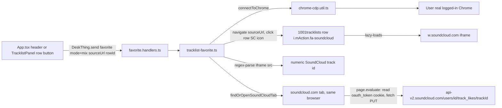

# CACP: Favorite Track on SoundCloud

**Status**: Planned — ready to implement
**Branch**: `feature/chrome-audio-control-platform`
**Base**: `master`
**Epic**: CACP (Chrome Audio Control Platform)
**Related**: [`cacp-tracklist-1001tl-lookup.md`](./cacp-tracklist-1001tl-lookup.md), [`cacp-tracklist-hardening-mediastore-split.md`](./cacp-tracklist-hardening-mediastore-split.md), [`cacp-app-now-playing-ui.md`](./cacp-app-now-playing-ui.md)
**Estimated effort**: 1–1.5 days
**Supersedes**: An earlier version of this doc (v1) built the in-mix flow as CDP-driven UI-click automation (navigate → click row SC icon → wait for widget iframe → click its Like button). That implementation shipped, then triggered a SoundCloud/DataDome bot-detection CAPTCHA during testing. The old code is preserved on branch `backup/cacp-favorite-cdp-automation` for reference. This version (v2) replaces the risky part — the simulated Like-button click — with a direct authenticated API call, based on live network capture. See Decision #1.

---

## Overview

Wire up "favorite this track on SoundCloud" from the cacp-app UI. Two genuinely different mechanisms, depending on what's playing:

1. **Standalone SoundCloud track** — the extension is already running a content script on the active `soundcloud.com` tab. Clicking a favorite button just needs to click the native like button there. No new infrastructure, unchanged from v1.
2. **In-mix track** (a DJ mix identified against 1001tracklists) — there's no "like" button for an individual track inside a SoundCloud mix stream. v1 automated the manual flow (open 1001TL, click the row's SoundCloud icon, click the widget's Like button). v2 automates the *underlying network call instead* — see below.

**What changed and why (live-captured during this planning pass):**

Clicking Like on a track in a real, logged-in `soundcloud.com` tab fires:

```
PUT https://api-v2.soundcloud.com/users/{userId}/track_likes/{trackId}?client_id={webClientId}&app_version={v}&app_locale=en
Headers: authorization: OAuth {token}
```

Two things made this directly callable instead of needing a simulated click:

- `client_id` is SoundCloud's **shared public web client id** (`O7atZypwLvuWSY9hWnnQ3vrLTHH7wqMe` at capture time) — the same one every soundcloud.com page load uses. It is not a per-app registered credential.
- The bearer `{token}` lives in a plain, non-`HttpOnly` cookie named `oauth_token`. Confirmed live: `document.cookie` on `soundcloud.com` exposes it directly (`2-312569-109927532-...`, matching the header byte-for-byte).

Replaying this exact call via `page.evaluate(() => fetch(...))` inside a real, already-logged-in `soundcloud.com` tab (same mechanism `connectToChrome()` already uses) was tested live: **200 `"OK"`**, and the response's `x-datadome-clientid` fingerprint header was auto-attached by SoundCloud's own page script — we never set it. That means this call is indistinguishable, from DataDome's perspective, from one triggered by a real UI click: same cookies, same TLS/browser fingerprint, same fetch-interceptor pipeline. There is no widget iframe to wait for, no button to find, and no simulated `Input.dispatchMouseEvent` on SoundCloud's own DOM at all for the actual favorite action.

**Path considered and rejected:** SoundCloud's official public API (`api.soundcloud.com`, OAuth 2.1 + PKCE, registered app) was live-checked during this planning pass (`soundcloud.com/you/apps/new` — confirmed no redirect-URI field yet on the registration form, requires an active Artist Pro subscription). The registration form's own terms explicitly list **"DJ applications (unless explicitly approved by SoundCloud)"** as generally disallowed. CACP's entire raison d'être is DJ mix tracklist identification, so registering an app for this would put it uncomfortably close to that banned category — risking the whole app registration (and API access) getting pulled during review, which is a worse failure mode than the CAPTCHA this doc fixes. The session-replay approach avoids that review surface entirely: no app registration, no ToS category to fall into, same account-scoped access a real user already has.

**Dependency chain:**

```
cacp-tracklist-1001tl-lookup.md (scraper, TracklistTrackSchema, chrome-cdp.util.ts)
  ↓
Phase 1: rowId added to TracklistTrackSchema + scraper (unchanged from v1, already shipped — see Note)
  ↓
Phase 2: standalone-track favorite (extension SoundCloudHandler + mediaStore) (unchanged from v1, already shipped — see Note)
  ↓
Phase 3: in-mix-track favorite — REWRITE as session-replay fetch instead of widget-click automation
  ↓
Phase 4: frontend wiring (unchanged from v1, already shipped — see Note)
```

**Note on repo state:** Phases 1, 2, and 4 already shipped correctly in v1 and are not bot-detection-risky (schema field, extension click, frontend buttons). Only Phase 3's automation module was reverted (see backup branch) because it was the CAPTCHA-triggering part. This doc's phasing below re-applies Phases 1/2/4 verbatim (they're small and it keeps this doc self-contained) and replaces Phase 3 with the new approach.

**What this is NOT:**

- Not a DeskThing hardware `LIKE` ability wiring — `AUDIO_REQUESTS.LIKE` in [`initializer.ts`](../../cacp-app/server/initializer.ts) stays stubbed exactly as-is.
- Not a "detect already-liked state" feature — v1 scope decision unchanged; favorite buttons don't show filled/unfilled state in v1.
- Not a matcher/scraper strategy change — untouched.
- Not the official SoundCloud public API — explicitly rejected this pass, see above.
- Not a persisted-credentials integration — no client secret, no refresh token, no `.env` entries. Auth is read live from the browser's own session cookie on every call; if you log out of SoundCloud in that Chrome profile, favoriting stops working until you log back in (same failure mode as the widget-click approach had).

---

## Decisions

| # | Question | Decision | Rationale |
| --- | --- | --- | --- |
| 1 | In-mix favorite mechanism | **Session-replay direct API call** — `page.evaluate(fetch(...))` against `api-v2.soundcloud.com/users/{id}/track_likes/{trackId}`, reusing the live session's `oauth_token` cookie and SoundCloud's shared public web `client_id` | v1's widget-click automation triggered a real DataDome CAPTCHA in testing. Live capture during this planning pass showed the actual network call the click produces is directly replayable — same cookies, same auto-attached DataDome fingerprint header — with zero simulated clicks on SoundCloud's own UI. Confirmed working (200 `"OK"`) against the real account before writing this plan. |
| 2 | Official public API path | **Rejected** | Requires Artist Pro subscription + registered app + Authorization Code OAuth 2.1/PKCE flow. Live-checked the registration form: its own terms list "DJ applications (unless explicitly approved by SoundCloud)" as generally disallowed — a real risk for an app whose purpose is DJ mix tracklist tooling. Session-replay reuses the exact access a logged-in user already has, with no registration surface to be reviewed against. |
| 3 | Automation owner for in-mix favorite | **Server-side CDP**, via `tracklist-favorite.ts` reusing `connectToChrome()` (unchanged from v1) | Still needed to click the 1001TL row's SoundCloud icon (to lazy-load the widget and learn the real numeric track id) and to run the session-replay fetch inside a real, logged-in browser context. The row-icon click stays on `1001tracklists.com` — it never touches SoundCloud's own DOM. |
| 4 | Automation owner for standalone-track favorite | **Extension content script**, clicking the native like button on the active tab (unchanged from v1) | Already proven, not implicated in the CAPTCHA — a single click on the page the user is actively viewing carries no more risk than any other extension-driven UI action already in production (play/pause/seek). Not touched by this pass. |
| 5 | Row selectors (mix case) | Row SC icon: `i.mAction.fa-soundcloud` inside `div.tlpItem[id^="tlp_"]` (unchanged from v1) | Still needed to reveal the widget iframe. Its `onclick` (`new MediaViewer(this, null, {idObject, idItem, idSource: '10', viewItem, ...})`) was inspected live this pass — `viewItem` is 1001tracklists' own internal id (e.g. `656401`), **not** the SoundCloud track id, confirming the widget iframe `src` is still the only source for the real numeric id. |
| 6 | Real SoundCloud track id source (mix case) | Regex-parsed from the lazy-loaded widget iframe's `src` (e.g. `...url=https%3A%2F%2Fapi.soundcloud.com%2Ftracks%2F252570245...`) | The widget iframe is already opened as a side effect of the row-icon click; its `src` embeds the real numeric id SoundCloud assigned the track. No separate lookup or scrape needed. |
| 7 | Where the session-replay fetch executes | A plain, already-open (or newly opened, then reused) tab on `soundcloud.com` — not inside the `w.soundcloud.com` widget iframe | `oauth_token` was confirmed readable via `document.cookie` on a `soundcloud.com`-origin page. Rather than assume the cookie's `Domain` also covers the widget's `w.soundcloud.com` subdomain (untested), reuse the same soundcloud.com tab context already validated live this pass. Prefer an existing `soundcloud.com` tab from `browser.pages()` over always spawning a new one — fewer CDP-created targets. |
| 8 | Standalone-track selector | `.sc-button-like` (unchanged from v1) | Not touched this pass. |
| 9 | Schema field for mix-row targeting | `rowId: z.string()` on `TracklistTrackSchema` (unchanged from v1, already shipped) | Same as before. |
| 10 | Toggle / un-favorite state | No new state-tracking code (unchanged from v1) | `PUT` likes, `DELETE` unlikes — confirmed live again this pass. v1 scope (add-only, no liked-state indicator) carries forward unchanged. |
| 11 | Command transport | `favorite` custom `DeskThing.on`/`DeskThing.send` channel (unchanged from v1, already shipped) | Same shape as before; `favoriteMixTrack`'s internals change, its external contract (`{ sourceUrl, rowId }` in, `{ success, error? }` out) does not. |
| 12 | Trigger surface | Now-playing header + per-row `TracklistPanel` button (unchanged from v1, already shipped) | Same as before. |

---

## What's In Scope

- Re-apply v1's already-shipped, non-risky pieces (Phases 1, 2, 4 below) since the branch was reset past them
- Rewrite `cacp-app/server/tracklist/tracklist-favorite.ts`: keep the 1001TL navigation + row-icon click + widget-iframe wait, drop all widget Like-button waiting/clicking, add track-id regex extraction from the iframe `src`
- New `cacp-app/server/tracklist/soundcloud-session-api.util.ts`: `findOrOpenSoundCloudTab(browser)`, `getAuthenticatedUserId(page)` (resolves via `GET /me`, no hardcoded account id), `likeTrackViaSession(page, userId, trackId)` (the session-replay `fetch`)
- Everything else (schema, extension, mediaStore, handlers, frontend hook, UI buttons) re-applied verbatim from v1

## What's Out of Scope

- **Official SoundCloud public API / OAuth app registration** → explicitly rejected this pass (Decision #2)
- **`AUDIO_REQUESTS.LIKE` / DeskThing hardware ability** → stays stubbed (unchanged from v1)
- **Liked-state indicator** → deferred (unchanged from v1)
- **Un-favorite as a distinct UI action** → deferred (unchanged from v1)
- **1001tracklists matcher/scraper strategy changes** → untouched
- **Standalone-track flow changes** → the extension click already works and wasn't implicated in the CAPTCHA; not touched

---

## Architecture

### Standalone-track favorite flow (unchanged from v1)

```mermaid
flowchart LR
  UI["App.tsx now-playing header button"] -->|"DeskThing.send favorite mode=standalone"| FavHandlers["favorite.handlers.ts"]
  FavHandlers --> MediaStore["mediaStore.handleFavoriteStandalone"]
  MediaStore -->|"media-command action=favorite"| Bridge["websocket-manager.js BridgeManager"]
  Bridge -->|"chrome.tabs.sendMessage media-control"| ContentScript["cacp.js handleControlCommand"]
  ContentScript --> SCHandler["soundcloud.js SoundCloudHandler.favorite"]
  SCHandler -->|"click .sc-button-like"| SCPage["Active soundcloud.com tab"]
```



### In-mix-track favorite flow (v2 — session replay)



### `TracklistTrackSchema` change (unchanged from v1)

```typescript
// tracklist.types.ts
export const TracklistTrackSchema = z.object({
  order: z.number(),
  cueSeconds: z.number().nullable(),
  artist: z.string(),
  title: z.string(),
  artworkUrl: z.string().url().optional(),
  processedArtwork: z.string().optional(),
  rowId: z.string(),   // e.g. "tlp_14067953", the row's DOM id
});
```

### `soundcloud-session-api.util.ts` (new, planned shape)

```typescript
const WEB_CLIENT_ID = 'O7atZypwLvuWSY9hWnnQ3vrLTHH7wqMe'; // SoundCloud's shared public web client id, not app-specific

export async function findOrOpenSoundCloudTab(browser: Browser): Promise<Page> {
  const existing = (await browser.pages()).find((p) => p.url().includes('soundcloud.com'));
  return existing ?? browser.newPage();
}

export async function getAuthenticatedUserId(page: Page): Promise<string | null> {
  return page.evaluate(async (clientId) => {
    const token = document.cookie.split('; ').find((c) => c.startsWith('oauth_token='))?.split('=')[1];
    if (!token) return null;
    const res = await fetch(`https://api-v2.soundcloud.com/me?client_id=${clientId}`, {
      headers: { authorization: `OAuth ${token}` },
    });
    if (!res.ok) return null;
    const body = await res.json();
    return String(body.id);
  }, WEB_CLIENT_ID);
}

export async function likeTrackViaSession(page: Page, userId: string, trackId: string): Promise<{ success: boolean; status?: number; error?: string }> {
  return page.evaluate(async (clientId, uid, tid) => {
    const token = document.cookie.split('; ').find((c) => c.startsWith('oauth_token='))?.split('=')[1];
    if (!token) return { success: false, error: 'oauth_token cookie not found — not logged in?' };
    const res = await fetch(
      `https://api-v2.soundcloud.com/users/${uid}/track_likes/${tid}?client_id=${clientId}`,
      { method: 'PUT', headers: { authorization: `OAuth ${token}` } },
    );
    return { success: res.ok, status: res.status };
  }, WEB_CLIENT_ID, userId, trackId);
}
```

### `tracklist-favorite.ts` (planned shape, replaces widget-click logic)

```typescript
export async function favoriteMixTrack(sourceUrl: string, rowId: string): Promise<FavoriteMixTrackResult> {
  const browser = await connectToChrome();
  const page = await browser.newPage();
  try {
    await page.goto(sourceUrl, { waitUntil: 'networkidle2', timeout: PAGE_LOAD_TIMEOUT_MS });
    const scIcon = await page.$(`#${rowId} i.mAction.fa-soundcloud`);
    if (!scIcon) return { success: false, error: 'SoundCloud icon not found for row' };

    const iframeCountBefore = (await collectWidgetIframeInfo(page)).length;
    await scIcon.click(); // 1001tracklists.com click only — not SoundCloud's DOM

    const frameHandle = await waitForNewWidgetIframe(page, iframeCountBefore, rowId, startedMs);
    if (!frameHandle) return { success: false, error: 'SoundCloud widget iframe not found' };

    const src = await page.evaluate((el) => (el as HTMLIFrameElement).src, frameHandle);
    const trackId = src.match(/tracks%2F(\d+)|tracks\/(\d+)/)?.[1];
    if (!trackId) return { success: false, error: 'Could not parse SoundCloud track id from widget src' };

    const scTab = await findOrOpenSoundCloudTab(browser);
    const userId = await getAuthenticatedUserId(scTab);
    if (!userId) return { success: false, error: 'Could not resolve SoundCloud user id — logged out?' };

    const result = await likeTrackViaSession(scTab, userId, trackId);
    return result.success
      ? { success: true }
      : { success: false, error: `track_likes API returned ${result.status}` };
  } finally {
    browser.disconnect();
  }
}
```

---

## Files to Create

| File | Purpose | Phase |
| --- | --- | --- |
| [`cacp-app/server/tracklist/soundcloud-session-api.util.ts`](../../cacp-app/server/tracklist/soundcloud-session-api.util.ts) | Session-replay helpers: find/open a soundcloud.com tab, resolve user id, PUT the like via the browser's own `oauth_token` cookie | 3 |
| [`cacp-app/server/favorite.handlers.ts`](../../cacp-app/server/favorite.handlers.ts) | `favorite` `DeskThing.on` channel, routes standalone vs. mix requests | 2, 3 |
| [`cacp-app/src/hooks/use-cacp-favorite.hook.ts`](../../cacp-app/src/hooks/use-cacp-favorite.hook.ts) | `favoriteCurrent()` / `favoriteTrack(rowId)`, mirrors `use-cacp-tracklist.hook.ts` | 4 |

## Files to Modify

| File | Change | Phase |
| --- | --- | --- |
| [`cacp-app/server/tracklist/tracklist.types.ts`](../../cacp-app/server/tracklist/tracklist.types.ts) | Add `rowId: z.string()` to `TracklistTrackSchema` | 1 |
| [`cacp-app/server/tracklist/tracklist-scraper.ts`](../../cacp-app/server/tracklist/tracklist-scraper.ts) | `parseTracklistDom` persists `row.id` as `rowId` | 1 |
| [`cacp-app/server/mediaStore.ts`](../../cacp-app/server/mediaStore.ts) | New `handleFavoriteStandalone()`, same shape as `handlePlay`/`handleSeek` | 2 |
| [`cacp-extension/src/sites/soundcloud.js`](../../cacp-extension/src/sites/soundcloud.js) | New `favorite()` method clicking `.sc-button-like` | 2 |
| [`cacp-extension/src/cacp.js`](../../cacp-extension/src/cacp.js) | `handleControlCommand` gets `case 'favorite':` | 2 |
| [`cacp-extension/src/managers/websocket-manager.js`](../../cacp-extension/src/managers/websocket-manager.js) | Bridge switch gets `case 'favorite':` | 2 |
| [`cacp-app/server/tracklist/tracklist-favorite.ts`](../../cacp-app/server/tracklist/tracklist-favorite.ts) | Rewrite: drop widget Like-button click/wait logic, add track-id regex parse + delegate to `soundcloud-session-api.util.ts` | 3 |
| [`cacp-app/server/initializer.ts`](../../cacp-app/server/initializer.ts) | Registers `registerFavoriteHandlers()` alongside existing handler registration | 2 |
| [`cacp-app/src/App.tsx`](../../cacp-app/src/App.tsx) | Favorite button in now-playing header; favorite button per row in `TracklistPanel` | 4 |

---

## Phasing

### Phase 1: Schema + scraper rowId capture (~30min — re-apply from v1)

- Add `rowId: z.string()` to `TracklistTrackSchema` in [`tracklist.types.ts`](../../cacp-app/server/tracklist/tracklist.types.ts)
- Update `parseTracklistDom` in [`tracklist-scraper.ts`](../../cacp-app/server/tracklist/tracklist-scraper.ts) to include `rowId: row.id`
- Delete cached tracklist JSON(s) so the next lookup re-scrapes with `rowId` populated — **not needed this time**: the cached `claptone-clapcast-570.json` used during this planning pass already has `rowId` populated from the v1 run, since data files survived the branch reset

**Outcome:** A fresh tracklist lookup produces tracks with non-empty `rowId` fields matching live 1001tracklists DOM ids.

---

### Phase 2: Standalone-track favorite (~1h — re-apply from v1)

- `soundcloud.js`: `favorite()` clicking `.sc-button-like`, returning `{ success, action: 'favorite' }`
- `cacp.js`: `handleControlCommand` gets `case 'favorite':`
- `websocket-manager.js`: bridge switch gets `case 'favorite':`
- `mediaStore.ts`: `handleFavoriteStandalone()` calling `sendCommandToExtension('favorite', {}, 'Favorite requested')`
- New `favorite.handlers.ts` registering the `favorite` channel; `{ mode: 'standalone' }` → `mediaStore.handleFavoriteStandalone()`
- Wire `registerFavoriteHandlers()` into `initializer.ts`

**Outcome:** With a standalone SoundCloud track playing, sending `{ mode: 'standalone' }` likes it — verifiable on `soundcloud.com/you/likes`.

---

### Phase 3: In-mix-track favorite via session replay (~2.5h — new)

- New `soundcloud-session-api.util.ts`: `findOrOpenSoundCloudTab`, `getAuthenticatedUserId`, `likeTrackViaSession` per the planned shape above
- Rewrite `tracklist-favorite.ts`: keep navigation + row-icon click + widget-iframe wait; add `src` regex parse for the real track id; replace widget Like-button click/wait with a call to `likeTrackViaSession`
- `favorite.handlers.ts`: `{ mode: 'mix', sourceUrl, rowId }` → `favoriteMixTrack`, unchanged external contract
- Structured logging via `tracklistLogger` at each step (navigate, icon click, iframe found, track id parsed, session tab resolved, API result) for debuggability

**Outcome:** Calling `favoriteMixTrack(sourceUrl, rowId)` for a known in-mix track likes that specific song on `soundcloud.com/you/likes`, with no simulated click on any SoundCloud-owned page element.

---

### Phase 4: Frontend wiring + verification (~1h — re-apply from v1)

- `use-cacp-favorite.hook.ts`: `favoriteCurrent()` / `favoriteTrack(rowId)`
- `App.tsx`: favorite button in now-playing header
- `TracklistPanel`: favorite button per row
- Manual verification pass across both flows

**Outcome:** From the emulator UI, both the header button (current track) and a tracklist row's button (arbitrary in-mix track) result in a like on `soundcloud.com/you/likes`.

---

## Verification checklist (manual)

- [ ] Fresh tracklist lookup produces tracks with populated `rowId` fields (or reuse the already-populated cached `claptone-clapcast-570.json`)
- [ ] Standalone favorite: playing a normal SoundCloud track and clicking the header favorite button adds it to `soundcloud.com/you/likes`
- [ ] Mix favorite: calling `favoriteMixTrack` for an in-mix track adds that specific song to `soundcloud.com/you/likes`, with no widget Like-button click in the logs
- [ ] Mix favorite on an already-liked track returns a clean result (API idempotently returns 200 on repeat `PUT`)
- [ ] No CAPTCHA/bot-detection challenge appears on the SoundCloud account after several mix-favorite calls in a row
- [ ] `cd cacp-app && npm run lint` passes with no new errors
- [ ] `cd cacp-extension && npm run lint` (or equivalent) passes with no new errors

---

## Key Files Referenced

| File | Note |
| --- | --- |
| [`cacp-app/server/tracklist/chrome-cdp.util.ts`](../../cacp-app/server/tracklist/chrome-cdp.util.ts) | `connectToChrome()` reused as-is |
| [`cacp-app/server/tracklist/tracklist-scraper.ts`](../../cacp-app/server/tracklist/tracklist-scraper.ts) | `parseTracklistDom` — where `row.id` is captured as `rowId` |
| [`cacp-app/server/tracklist/tracklist.types.ts`](../../cacp-app/server/tracklist/tracklist.types.ts) | `TracklistTrackSchema` — has the `rowId` field |
| [`cacp-app/server/tracklist/tracklist.handlers.ts`](../../cacp-app/server/tracklist/tracklist.handlers.ts) | Reference pattern for `favorite.handlers.ts`'s `DeskThing.on`/`DeskThing.send` channel |
| [`cacp-app/server/mediaStore.ts`](../../cacp-app/server/mediaStore.ts) | `sendCommandToExtension` pattern reused for `handleFavoriteStandalone` |
| [`cacp-app/server/initializer.ts`](../../cacp-app/server/initializer.ts) | `AUDIO_REQUESTS.LIKE` stub — confirmed staying untouched |
| [`cacp-extension/src/sites/soundcloud.js`](../../cacp-extension/src/sites/soundcloud.js) | `SoundCloudHandler` — has the `favorite()` method (standalone flow) |
| [`cacp-extension/src/sites/base-handler.js`](../../cacp-extension/src/sites/base-handler.js) | `clickElement` helper reused for the standalone favorite click |
| [`cacp-extension/src/cacp.js`](../../cacp-extension/src/cacp.js) | `handleControlCommand` switch — has the `favorite` case |
| [`cacp-extension/src/managers/websocket-manager.js`](../../cacp-extension/src/managers/websocket-manager.js) | `BridgeManager` inbound command switch — has the `favorite` case |
| [`cacp-extension/manifest.json`](../../cacp-extension/manifest.json) | Confirmed no changes needed |
| [`cacp-app/src/hooks/use-cacp-tracklist.hook.ts`](../../cacp-app/src/hooks/use-cacp-tracklist.hook.ts) | Reference pattern for `use-cacp-favorite.hook.ts` |
| [`cacp-app/src/App.tsx`](../../cacp-app/src/App.tsx) | `TracklistPanel` + now-playing header — where the two favorite buttons get added |
| `backup/cacp-favorite-cdp-automation` (git branch) | v1's widget-click automation code, preserved for reference — not merged |

---

## Related Documentation

- [`cacp-tracklist-1001tl-lookup.md`](./cacp-tracklist-1001tl-lookup.md) — the scraper/schema/CDP infrastructure this builds on
- [`cacp-tracklist-hardening-mediastore-split.md`](./cacp-tracklist-hardening-mediastore-split.md) — `mediaStore.ts`/`tracklist.handlers.ts` module boundaries this follows
- [`cacp-app-now-playing-ui.md`](./cacp-app-now-playing-ui.md) — the now-playing UI the favorite header button gets added to
- [`docs/cacp/architecture.md`](../cacp/architecture.md) — overall CACP system architecture

---

*Last Updated: July 3, 2026*
